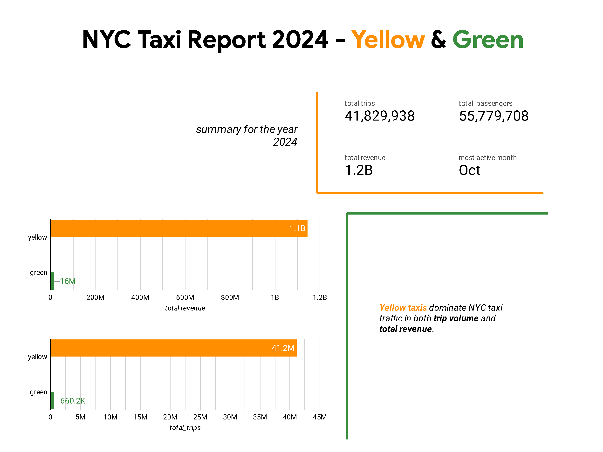
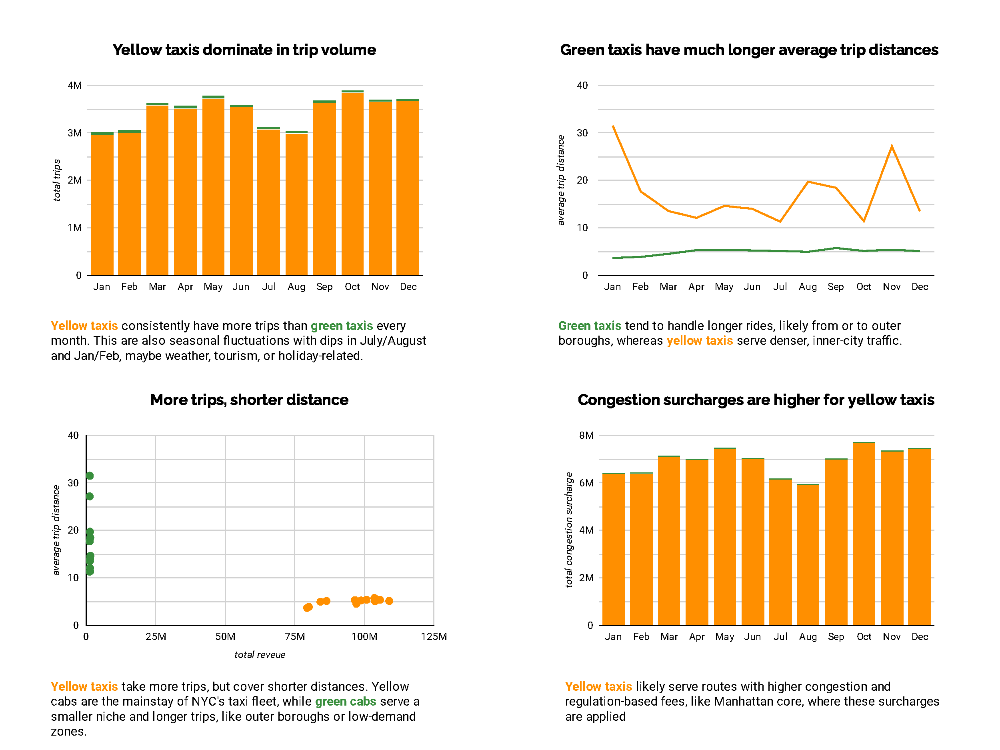

# NYC Taxi Trip Data Pipeline with PySpark

This project supports running a PySpark job in three different modes depending on the execution environment and scale:

- **Local Mode** – for quick testing and development on a single machine
- **Standalone Spark Cluster** – for distributed processing using a manually configured Spark cluster
- **Google Cloud Dataproc Cluster** – for fully managed Spark jobs using GCP infrastructure, with support for writing output to GCS or BigQuery

## Input Data and Processing
- Input Data: Raw Parquet files for yellow and green NYC taxi trips, downloaded from [NYC TLC Trip Record Data](https://www.nyc.gov/site/tlc/about/tlc-trip-record-data.page).
- Use the provided `download_data.sh` script to download raw data files from the NYC TLC website and save to `data/raw/`.
- `notebooks/exploratory.ipynb` was used to standardize the schema and save to `data/pq/`.

## Spark Job and Output
- A PySpark job is used to merge the yellow and green datasets, compute monthly aggregates like revenue, passenger count and trip distance, and output the results to:
-  Local disk (for local/standalone runs) in `data/report`.
-  Google Cloud Storage (GCS) or BigQuery (scalable clusters using Dataproc)

## Dashboard and reporting
- Google Looker Studio is used to build a dashboard based on the monthly aggregated stats saved to BigQuery via Dataproc.

Below are instructions for running the pipeline in each mode via CLI:

## 1. Spark local mode

```
python spark_job/generate_report_local.py \
 --input_green=data/pq/green/2024/*/ \
 --input_yellow=data/pq/yellow/2024/*/* \
 --output=data/report/2024
```


## 2. Standalone Spark Cluster
Use `spark-submit` for running the script on the cluster

URL="spark://de-vm.asia-south1-c.c.velvety-tangent-463717-h8.internal:7077"

```
spark-submit \
    --master="${URL}" \
    spark_job/generate_report_standalone_cluster.py \
    --input_green=data/pq/green/2024/*/ \
    --input_yellow=data/pq/yellow/2024/*/* \
    --output=data/report/2024
```

## 3. Dataproc Cluster
We can submit job through dataproc cluster

Here, we first get data from GCS. After processing it, we have 2 options to store it:

### 3a. Store it back in GCS

Using google cloud sdk:
```
gcloud dataproc jobs submit pyspark \
    --cluster=de-cluster \
    --region=asia-south1 \
    gs://data_lake_de_bucket/spark_job_generate_report.py \
    -- \
    --input_green=gs://data_lake_de_bucket/pq/green/2024/* \
    --input_yellow=gs://data_lake_de_bucket/pq/yellow/2024/* \
    --output=gs://data_lake_de_bucket/report-2024
```
We can also do it using using using Rest API and the web UI.

using Web UI:
```
spark-submit \
    --master="${URL}" \
    spark_job_generate_report.py \
    --input_green=gs://data_lake_de_bucket/pq/green/2024/*/ \
    --input_yellow=gs://data_lake_de_bucket/pq/yellow/2024/*/* \
    --output=gs://data_lake_de_bucket/report/2024
```

### 3b. Write results to BigQuery (From Data Lake to Data Warehouse)

First, change the `output` argument in the script, and set the `temporaryGcsBucket`, created when making the GCS bucket:
Nxt, upload the `.py` script to GCS:

```
gsutil -m cp -r generate_report_dataproc_cluster_to_Big_Query.py gs://data_lake_de_bucket/generate_report_dataproc_cluster_to_Big_Query.py
```
And run thr command below:

Using google cloud sdk:
```
gcloud dataproc jobs submit pyspark \
     --cluster=de-cluster \
     --region=asia-south1 \
     gs://data_lake_de_bucket/spark_job_generate_report_big_query.py \
     -- \
     --input_green=gs://data_lake_de_bucket/pq/green/2024/* \
     --input_yellow=gs://data_lake_de_bucket/pq/yellow/2024/* \
     --output=trips_data_all.report-2024
```

## Interactive Dashboard & Key Insights
Once the aggregated output is written to BigQuery, Looker Studio is used as the final reporting layer to enable business-friendly visualization and exploration.
The visualization highlights seasonality, trip distribution, and revenue patterns between yellow and green taxis.

<p align="center">


<p align="center">
